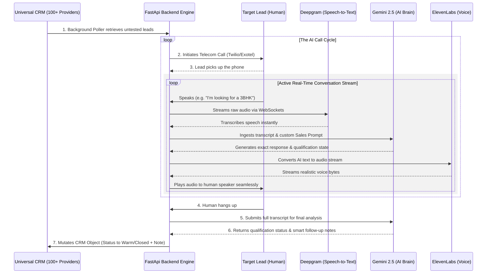
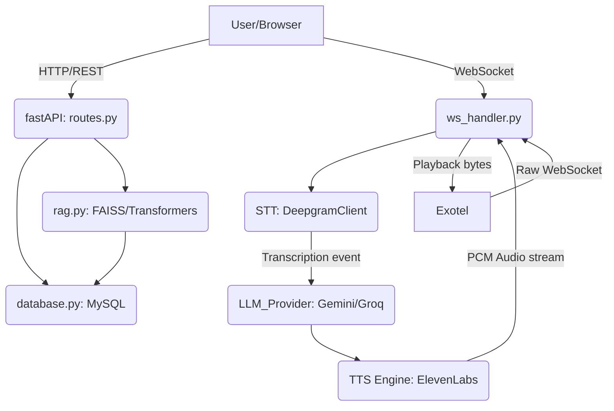

# 🚀 Globussoft Generative AI Dialer

A full-stack, AI-native CRM designed to fully automate telecom sales, field ops geofencing, and internal workflows under the Globussoft architecture.

## 🌍 Live Environments
- **Production Development:** `https://test.callified.ai`
- **Frozen Sales Demo:** `https://demo.callified.ai` (Running Release `v1.0.0-demo`)


## 📞 Live AI Call Flow Schematic


## 🧠 Core System Flow & Microservices



### 1. `main.py`
Acts as the central orchestrator and ASGI app.
* **Bootstrapping**: Initializes the FastAPI app, manages environment variables (`EXOTEL_API_KEY`, etc.), and mounts sub-routers (`auth.py`, `routes.py`, `live_logs.py`, `ws_handler.py`).
* **Background Process**: Defines `poll_crm_leads()` which runs as an `asyncio.create_task` loop inside the main process to check external CRM APIs every 60 seconds for new leads.
* **Dial Management**: Includes fallback methods for WhatsApp triggering and bridging out to Twilio/Exotel via REST before the call shifts to WebSockets.

### 2. `ws_handler.py` (The Heart of Realtime)
Handles the full-duplex bi-directional streaming of AI calls.
* **Connections**: Listens on `/ws/sandbox` (React microphone testing) and `/media-stream` (Exotel raw μ-law testing).
* **Pipeline Integration**: Re-packages raw byte packets and ships them to Deepgram for live transcription. When Deepgram issues an `on_message` callback, the handler hits `llm_provider.py` and streams those chunks dynamically into `tts.py`.
* **State Management**: Uses memory dictionaries like `whisper_queues`, `active_tts_tasks`, and `takeover_active` to manage asynchronous racing conditions between AI replies and human barge-in ("listening...").

### 3. `database.py`
The sole persistence layer of the app.
* Runs on pure `pymysql` with raw SQL queries mapping to `callified_ai`.
* Handles over 15 distinct entities: `leads`, `calls`, `tasks`, `documents`, `products`, `knowledge_base`, `pronunciation_guide`, etc.
* **Domain Triggers**: Embeds domain-logic inside writes (e.g. cross-department automation when `status="Closed"` or WhatsApp Nudge generation when `status="Warm"`).

### 4. `routes.py`
Exposes the CRUD endpoints for your Next.js Frontend.
* Contains `/api/leads`, `/api/tasks`, `/api/products`, `/api/knowledge/upload`, etc.
* **Scraping Capability**: Implements an HTTP scraping crawler inside `/api/products/{product_id}/scrape` using Llama-3 parsing when product pages are linked.
* Includes a fully replicated Mobile API namespace via `APIRouter(prefix="/api/mobile")`.

### 5. `rag.py` & Vector Search
The local Knowledge Base Retrieval tool.
* Bypasses heavy cloud vector databases by utilizing local `faiss` indices.
* Embeds documents using the lightweight, open-source `sentence-transformers` (`all-MiniLM-L6-v2`) locally within the CPU environment.
* Generates `.index` dumps and metadata inside a dynamically created `/faiss_indexes/` repository folder.

### 6. `tts.py` & `llm_provider.py`
External Model Clients.
* **`tts.py`**: Fetches Voice Settings from the database context and fires off streaming requests to ElevenLabs or Google Cloud TTS, ensuring the audio is returned in the precise sample rate chunked formats (`PCM 16000` or `PCM 8000 mu-law`).
* **`llm_provider.py`**: A fallback wrapper that defaults to Groq (Llama-3 70b) and falls back to Gemini `1.5-flash` natively to ensure 99% uptime on generation.


## Features Developed

1. **Multilingual AI Voice Agent (Dialer)**
   - Unified Outbound caller supporting both **Twilio** and **Exotel**.
   - Bidirectional real-time `media-stream` webSockets.
   - Powered by Gemini 2.5 LLM context and Deepgram transcription.

2. **Automated Exotel Call Summarizer**
   - Automatically catches completed `.mp3` recordings from Exotel.
   - Transcribes Indian English, Hindi, and Bengali using Deepgram `nova-3`.
   - Summarizes the transcript into distinct *Client Sentiment*, *Budget*, and *Next Steps* using Gemini.
   - Injects the AI Follow-Up Note permanently into the CRM SQLite Database.

3. **Geofenced Field Operations Module**
   - HTML5 `navigator.geolocation` integration for agent site-visits.
   - FastAPI `haversine` formula verifies whether the agent's GPS coordinates are precisely within 500m of a designated Site.
   - Accurate, un-spoofable attendance logging directly attached to the CRM.

4. **Cross-Department Workflow Engine**
   - Automatically monitors CRM Lead stages.
   - Auto-generates Internal Kanban Tickets for `Legal`, `Accounts`, and `Housing Loan` teams when Deals are Closed.
   - Real-time React KPI Reporting.

5. **WhatsApp Automation Triggers (Mocked)**
   - Smart backend engine that fires structural WhatsApp Nudges.
   - For example: Automatically texts Property e-Brochures when an AI categorizes a Lead as "Warm".
   - Viewable via a WhatsApp-Web styled UI within the Dashboard.

6. **CRM Document Vault**
   - Natively attach files and compliance agreements to specific Leads.
   - Distinct SQLite mappings for secure retrieval (`Aadhar`, `PAN`, `Sales Agreements`).
   - Unified Modal UI injected straight into the core CRM.

7. **Visual Data Analytics Center**
   - Natively rendered, dynamic CSS Flexbox charting engine.
   - Visualizes "Call Volume vs. Closed Deals" 7-day trailing trends.
   - Zero-dependency executive monitoring portal for internal stakeholders.

8. **Global Smart Search Query API**
   - Universal parameter-based SQLite matching engine (`LIKE %...%`).
   - Find Clients by exact Name, substring, or direct Phone Number matches instantly.
   - Beautiful dashboard search-bar state mutation architecture.

9. **Database CSV Export Engine**
   - High-speed Python pipeline converting SQLite arrays into downloadable Dataframes.
   - Streams native `.csv` files via FastApi directly to the Sales Director's local machine.

10. **Role-Based Access Control (RBAC)**
    - Enterprise security UI guardrails hiding sensitive PII and executive data.
    - Simulated `[Admin]` vs `[Agent]` viewer contexts to lock down database export and global metrics routes natively.

11. **Manual Quick Notes System**
    - Instantaneous human-override timeline logging.
    - Allows agents to bypass the LLM Voice agent and directly manually update Client profiles post-call.

12. **GenAI One-Click Email Drafter**
    - Autonomously drafts hyper-personalized follow-up emails based on SQLite timeline history.
    - Leverages Gemini 1.5 Flash natively directly inside the React table.

13. **Sub-Second Latency Audio Streaming**
    - Integrates background Python `asyncio.Queue` chunkers to immediately synthesize and pipeline Elevenlabs audio by NLTK-parsed sentences *while* the LLM is actively streaming tokens. Achieving real-time phone calls with Time-to-First-Byte audio latency under 800ms.

14. **Clean Componentized React Architecture**
    - The monolith Dashboard is split cleanly into discrete `<CrmTab />`, `<OpsTab />`, and `<SettingsTab />` JSX modules.

15. **Local FAISS Knowledge Base (RAG)**
    - Performs localized vector retrieval without external databases.
    - Uses `sentence-transformers` to chunk and embed `.pdf` documents directly into the local `faiss_indexes` folder for lightning-fast knowledge ingestion.

16. **Deep Backend WebSocket Automation Tests**
    - Simulates Exotel bytes and Sandbox WebSockets directly inside the ASGI thread.
    - Intercepts LLM, STT, and TTS engines down to the microsecond level so development CI/CD pipelines run natively without live API costs.

## 🛠 Getting Started

Follow these instructions to set up, run, and test the Generative AI Dialer locally.

### Prerequisites

You will need the following installed on your machine:
- **Node.js** (v16 or higher)
- **Python** (3.9 or higher)
- **Git**

You will also need accounts and API keys for the following services:
- **Twilio** or **Exotel** (For telecom/dialing)
- **Deepgram** (For prompt Speech-to-Text)
- **Google AI Studio / Gemini** (For the core conversation and sales LLM logic)
- **ElevenLabs** (For realistic Voice/TTS)
- **Ngrok** (For localhost tunneling to receive call webhooks)

### 1. Clone the Repository
```bash
git clone <your-repository-url>
cd gbs-ai-dialer
```

### 2. Environment Configuration
Create a `.env` file in the root of the project (the same folder as `main.py`) and populate it exactly as follows with your own credentials:

```ini
# --- TELECOM PROVIDERS ---
# Which dialer to use by default: 'twilio' or 'exotel' (Currently Exotel on Live)
DEFAULT_PROVIDER=exotel

# Twilio Configuration
TWILIO_ACCOUNT_SID=your_twilio_sid
TWILIO_AUTH_TOKEN=your_twilio_auth_token
TWILIO_PHONE_NUMBER=your_twilio_phone_number

# Exotel Configuration (If using Exotel instead of Twilio)
EXOTEL_API_KEY=your_exotel_api_key
EXOTEL_API_TOKEN=your_exotel_api_token
EXOTEL_ACCOUNT_SID=your_exotel_account_sid
EXOTEL_CALLER_ID=your_exotel_caller_id

# --- AI SERVICES PIPELINE ---
# Model Routing
LLM_PROVIDER=groq
TTS_PROVIDER=elevenlabs

# API Keys
DEEPGRAM_API_KEY=your_deepgram_api_key
GROQ_API_KEY=your_groq_api_key
GEMINI_API_KEY=your_gemini_api_key
ELEVENLABS_API_KEY=your_elevenlabs_api_key
ELEVENLABS_VOICE_ID=your_elevenlabs_voice_id
SMALLEST_API_KEY=your_smallest_ai_key
SMALLEST_VOICE_ID=your_smallest_ai_voice_id

# --- NETWORKING & AUTH ---
# Server domain for Webhook Audio Streams (Ngrok or test.callified.ai)
PUBLIC_SERVER_URL=https://your-ngrok-url.ngrok-free.app
PUBLIC_URL=https://your-ngrok-url.ngrok-free.app
JWT_SECRET=your_secure_jwt_secret
MYSQL_HOST=localhost
MYSQL_USER=callified
MYSQL_PASSWORD=your_password
MYSQL_DATABASE=callified_ai
```

### 3. Start Ngrok (Webhook Tunneling)
For Twilio or Exotel to reach your local backend during a live call, you must expose your local port `8000` to the public internet securely.
```bash
ngrok http 8000
```
*Copy the `Forwarding` HTTPS URL (e.g., `https://abc-123.ngrok.app`) and paste it into the `PUBLIC_SERVER_URL` variable in your `.env` file.*

### 4. Run the Backend (FastAPI)
Open a terminal in the root directory:
```bash
# Create and activate a virtual environment
python -m venv .venv

# On Windows:
.venv\Scripts\activate
# On Mac/Linux:
# source .venv/bin/activate

# Install dependencies
pip install -r requirements.txt

# Run the server
uvicorn main:app --reload --port 8000
```

### 5. Run the Frontend (React)
Open a new terminal session:
```bash
cd frontend
npm install
npm run dev -- --port 5173
```
Visit `http://localhost:5173` in your browser to view the AI Dialer CRM Dashboard!

### 6. Linking Webhooks (Crucial Step)
Depending on your chosen provider, you must confirm their webhook configurations so the AI can intercept the call.

**If using Twilio:**
You do *not* need to manually configure the webhook endpoint on the Twilio dashboard. The application dynamically builds and passes the webhook (`/webhook/twilio`) during the API call initiation! Just ensure your `PUBLIC_SERVER_URL` inside the `.env` is perfectly accurate and your `TWILIO_PHONE_NUMBER` is verified on Twilio if using a trial account.

**If using Exotel:**
You must configure an Exotel **VoiceBot Applet** in your Exotel call flow visualizer. The applet should point its WebSocket URL to:
`wss://<YOUR-NGROK-URL-WITHOUT-HTTPS>/media-stream`
When the call connects, Exotel will stream the audio down this WebSocket connecting the client perfectly to the AI.

### 7. Automated E2E Testing
The project abandons traditional local mocking in favor of two controllable End-to-End Test suites that execute real database permutations and API testing natively across environments.
To verify codebase integrity, run one of the two top-level triggers based on the environment you are validating:

```bash
# Validate core backend WebSockets (Sandbox + Exotel Streams natively via TestClient)
# Uses mock providers to verify STT/TTS routing without burning API tokens.
python -m pytest tests/e2e/test_ws_core.py -v --cov=ws_handler --cov-report=term-missing

# E2E Script triggers for full environment runs:
# Validates your active localhost (http://localhost:8000)
python run_local_e2e.py

# Validates the active remote sandbox (https://test.callified.ai)
python run_server_e2e.py
```
