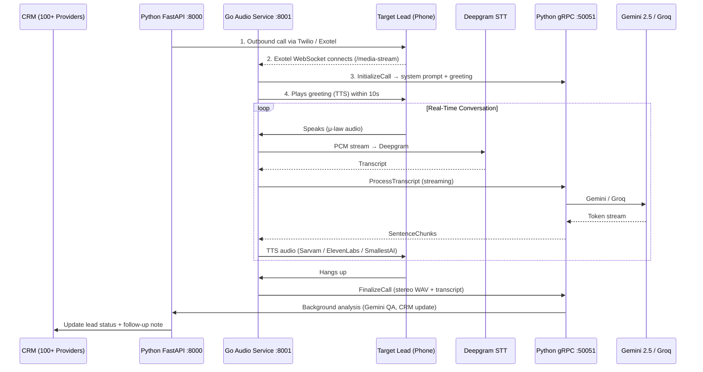

# Callified AI Dialer

A production-grade, AI-native outbound CRM designed to fully automate telecom sales calls in Hindi, Marathi, and 9+ Indian languages. Built on a Python + Go hybrid architecture — Python owns the AI brain, Go owns the real-time audio pipeline.

## Live Environments

- **Production / Dev:** `https://test.callified.ai`
- **Frozen Sales Demo:** `https://demo.callified.ai` (Release `v1.0.0-demo`)

---

## Architecture Overview

The system uses a **Python + Go hybrid**. Traffic is routed by Nginx:

```
                        ┌─────────────────────────────┐
                        │  Nginx  (L7 proxy + split)   │
                        └──────────────┬──────────────┘
                                       │
              /media-stream, /ws/*     │     /api/(auth|leads|campaigns|…)
              ─────────────────────    │     ─────────────────────────────
                        │             │             │
              ┌─────────▼──────────┐  │  ┌─────────▼──────────┐
              │  Go Audio Service  │  │  │  Go REST API        │
              │  :8001             │◄─┘  │  :8001              │
              │                    │     └─────────────────────┘
              │  WebSocket         │
              │  STT streaming     │     /api/(analytics|knowledge|…)
              │  TTS streaming     │     ──────────────────────────────
              │  Echo cancel       │              │
              │  Stereo recording  │     ┌────────▼───────────┐
              │  Redis state       │     │  Python FastAPI     │
              └────────┬───────────┘     │  :8000              │
                       │ gRPC :50051     │  LLM + prompts      │
                       └────────────────►  RAG + FAISS         │
                                         │  103 CRM providers  │
                                         │  AI generation      │
                                         └────────┬────────────┘
                                                  │
                                         ┌────────▼────────────┐
                                         │  MySQL  +  Redis     │
                                         └─────────────────────┘
```

| Layer | Technology | Responsibility |
|-------|-----------|----------------|
| WebSocket / Audio | **Go** `:8001` | Exotel/Twilio media streams, STT, TTS, echo cancellation, recording |
| REST API (CRUD) | **Go** `:8001` | Auth, leads, campaigns, orgs, products, tasks, reports, pronunciations, recordings |
| AI Logic | **Python gRPC** `:50051` | Prompt building, Gemini/Groq LLM, call analysis |
| REST API (AI/CRM) | **Python FastAPI** `:8000` | Knowledge base, integrations, WhatsApp, AI generation, CRM providers |
| Data | **MySQL** + **Redis** | Persistence + call state |

---

## Live AI Call Flow



---

## Repository Structure

```
callified-ai-dailer/
├── go-audio-service/          # Go: WebSocket audio pipeline + REST API
│   ├── cmd/audiod/main.go     # Entry point — HTTP server, gRPC client
│   ├── internal/
│   │   ├── api/               # REST handlers (auth, leads, campaigns, …)
│   │   ├── audio/             # PCM codec, echo cancellation, stereo recorder
│   │   ├── config/            # Env var parsing
│   │   ├── db/                # MySQL data layer (mirrors database.py)
│   │   ├── llm/               # gRPC client + sentence splitter
│   │   ├── metrics/           # Prometheus metrics
│   │   ├── redis/             # Redis store (pending calls, whispers, takeover)
│   │   ├── stt/               # Deepgram WebSocket client
│   │   ├── tts/               # ElevenLabs, Sarvam AI, SmallestAI providers
│   │   └── wshandler/         # WebSocket handler, pipeline orchestrator, monitor
│   ├── proto/callified/v1/    # Protobuf definitions (Go ↔ Python gRPC)
│   ├── Dockerfile
│   └── Makefile
├── nginx/
│   ├── callified.conf         # Main Nginx config (routing + TLS)
│   └── go_ramp.conf           # Shadow-mode traffic split (0–100%)
├── scripts/
│   ├── deploy-go.sh           # Blue/green zero-downtime deployment
│   └── set-ramp.sh            # Adjust Go traffic percentage without restart
├── tests/
│   ├── e2e/                   # Python API + WebSocket E2E tests
│   └── ui_e2e/                # Playwright browser tests
├── frontend/                  # React SPA
├── main.py                    # Python FastAPI entry point
├── ws_handler.py              # Python WebSocket (legacy, being phased out)
├── database.py                # Python MySQL layer
├── prompt_builder.py          # LLM prompt construction
├── grpc_server.py             # Python gRPC logic server (:50051)
├── docker-compose.yml         # Full-stack: MySQL, Redis, Python, Go, Nginx
└── .env.example               # Environment variable template
```

---

## Core Services

### Go Audio Service (`go-audio-service/`)

The real-time audio pipeline rewritten in Go to eliminate Python GIL contention:

- **WebSocket handler** — accepts Exotel binary μ-law frames and JSON media events; browser sim (`/ws/sandbox`); manager monitor (`/ws/monitor/{stream_sid}`)
- **STT** — Deepgram WebSocket client with nova-2/nova-3 model selection per language, 5-second keepalive to prevent Exotel VoiceBot timeout
- **TTS** — three hot-swappable providers:
  - *Sarvam AI Bulbul v3* (WebSocket streaming, best for native Hindi/Marathi)
  - *ElevenLabs Turbo v2.5* (HTTP streaming + 16kHz→8kHz PCM decimation)
  - *SmallestAI Lightning* (HTTP streaming, <100ms latency)
- **Echo cancellation** — audio-level RMS cross-correlation against the last 500ms of TTS output; Deepgram never receives echo
- **Barge-in** — context-cancel active TTS and send `{"event":"clear"}` to Exotel on speech detection mid-TTS
- **Backchanneling** — language-aware filler injection ("Hmm…", "Achha…", "Theek ahe…") at 60% probability when user speaks >2 words
- **Stereo recording** — left channel = user mic, right channel = AI TTS; merged to timestamped WAV in `RECORDINGS_DIR`
- **Precise HANGUP** — calculated from bytes-sent + timestamp instead of `sleep(7)`
- **REST API** — 34 endpoints for auth, leads, campaigns, orgs, products, tasks, reports, pronunciations, and recording file serving

### Python gRPC Logic Server (`grpc_server.py`)

Wraps the AI logic into 4 gRPC RPCs that Go calls per conversation turn:

| RPC | Called when | Does |
|-----|------------|------|
| `InitializeCall` | WebSocket connect | Returns system prompt, greeting, TTS config |
| `ProcessTranscript` | Each user utterance | Streams LLM sentence chunks back to Go |
| `FinalizeCall` | Call ends | Saves transcript, triggers Gemini QA analysis |
| `RetrieveContext` | Optional RAG | Returns FAISS-retrieved product knowledge |

### Python FastAPI (`main.py` / `routes.py`)

Handles everything that doesn't need sub-millisecond latency:
- CRM polling (100+ provider integrations)
- Knowledge base upload / FAISS indexing
- AI-generation endpoints (scrape product pages, generate prompts, draft emails)
- WhatsApp automation triggers
- Sites / geofenced field ops

### Nginx Routing

| Path pattern | Backend |
|-------------|---------|
| `/media-stream`, `/ws/*` | Go `:8001` (shadow-mode split controlled by `go_ramp.conf`) |
| `/api/(auth\|leads\|campaigns\|organizations\|products\|tasks\|reports\|pronunciation\|recordings)` | Go `:8001` |
| `/api/*` (everything else) | Python `:8000` |
| `/metrics` | Go `:8001` (internal networks only) |
| `/health` | Go `:8001` |

---

## Features

### Audio Pipeline

1. **Multilingual AI Voice Agent** — Hindi, Marathi, Tamil, Telugu, Bengali, Gujarati, Kannada, Malayalam, Punjabi, English via Deepgram nova-2/nova-3 + Gemini 2.5
2. **Audio-Level Echo Cancellation** — RMS cross-correlation suppresses AI playback before it reaches Deepgram; no more phantom transcripts
3. **Barge-In / Interruption** — user speech instantly cancels TTS and sends Exotel `clear` event; AI responds to the interruption
4. **Language-Aware Backchanneling** — filler phrases injected mid-conversation to sound natural ("Achha…", "Theek ahe…", "Haan…")
5. **Precise Call HANGUP** — playback tracker calculates exact remaining audio duration; no more fixed `sleep(7)` grace periods
6. **Server-Side Stereo Recording** — left = user mic, right = AI TTS; zero re-encoding, 100% call coverage even when Exotel recording API lags
7. **Multi-Provider TTS** — Sarvam AI, ElevenLabs, SmallestAI; hot-swappable per organization from the dashboard

### Real-Time Operations

8. **Manager Monitor WebSocket** (`/ws/monitor/{stream_sid}`) — supervisors connect to receive live transcripts, inject whispers into the AI's next response, or take over the call with their own voice
9. **Redis-Backed Horizontal Scaling** — call state (pending metadata, takeover flags, whisper queues) in Redis with TTL auto-cleanup; fallback to in-memory if Redis is unavailable
10. **Zero-Downtime Deployment** — blue/green via `scripts/deploy-go.sh`; new binary starts on `:8002`, health-checked, Nginx swapped, old instance drains 60s for active calls to finish naturally

### REST API (Go)

11. **JWT Auth** — `POST /api/auth/login`, `POST /api/auth/signup`, `GET /api/auth/me`; tokens are HS256-signed and interoperable with the Python service
12. **Leads CRUD** — list, create, update, delete, search, `GET /api/leads/export` (CSV), `GET /api/leads/sample-csv` (import template), bulk CSV import, documents, transcripts
13. **Campaigns** — full CRUD, add/remove leads, call log with Exotel-style outcomes, aggregate stats (total / called / qualified / appointments), TTS voice settings with org fallback
14. **Organizations & Products** — org CRUD + timezone + TTS voice settings; product CRUD + agent persona + call flow instructions
15. **Tasks, Reports, Pronunciations** — task list + complete; org-level KPI report; pronunciation guide upsert (injected into LLM system prompt for accurate product name TTS)
16. **Recording File Serving** — `GET /api/recordings/{filename}` serves stereo WAV files auth-gated with path-traversal protection

### Observability

17. **Prometheus Metrics** — 9 metrics exposed at `/metrics`: active calls gauge, call duration, STT/LLM/TTS TTFB histograms, gRPC latency, echo suppressions, barge-ins, HANGUP wait
18. **Structured Logging** — `go.uber.org/zap` zero-alloc structured logs across all Go goroutines

### AI & CRM

19. **Automated Call QA** — Gemini post-call analysis produces `quality_score`, `appointment_booked`, `customer_sentiment`, `what_went_well`, `what_went_wrong`, `prompt_improvement_suggestion`
20. **103 CRM Provider Integrations** — background poller syncs leads from Salesforce, HubSpot, Zoho, and 100+ others
21. **RAG Knowledge Base** — local FAISS + `sentence-transformers`; product PDFs indexed into `/faiss_indexes/`; context injected into every LLM call
22. **WhatsApp Automation** — fires e-brochures and follow-up messages when AI categorizes a lead as "Warm"
23. **GenAI Email Drafter** — one-click Gemini-generated follow-up emails based on call transcript history

### Testing & CI

24. **Go Conformance Tests** — 15 unit tests covering stream-type detection, WebSocket event handling, STT barge-in, WAV header correctness, sentence splitter, Redis whisper atomics
25. **Playwright E2E Tests** — 19 browser automation tests against `test.callified.ai` covering auth, CRM CRUD, settings, modals
26. **Python API + WebSocket E2E** — `test_api_v1.py` and `test_ws_core.py` run against the live environment
27. **GitHub Actions CI** — Go tests → Go Docker build → Python API tests → WebSocket tests → Playwright tests; runs on every push to `main`

---

20. **Comprehensive Playwright E2E Test Suite (19 Tests)**
    - Full browser automation testing against the live production environment.
    - Covers: Auth (signup/logout), CRM (add/edit/delete/search leads), Settings (products, pronunciation), Ops, Analytics, WhatsApp, Integrations tabs, and CRM modals (transcripts, documents, notes).
    - Auto-cleanup fixture removes test data after each session.
    - GitHub Actions CI pipeline runs all tests on every push.

## 🐳 Docker Local Deployment (Recommended)

The fastest way to run the full stack locally — no manual MySQL/Redis setup required. Requires **Docker Desktop** and **Docker Compose v2**.

### 1. Copy the environment template

```bash
cp .env.example .env
```

Edit `.env` and fill in your real API keys (Gemini/Groq, Deepgram, ElevenLabs, Twilio/Exotel, etc.). The internal service hostnames are pre-wired — do **not** change these lines:

```
MYSQL_HOST=mysql          # matches the docker-compose service name
GRPC_ADDR=python-api:50051
REDIS_URL=redis://:${REDIS_PASSWORD}@redis:6379/1
```

### 2. Build and start all services

```bash
docker compose up --build
```

This will:
- Build the **React frontend** (Node 20) and embed it into the Python API image
- Start **MySQL 8.0** on port `3307` (avoids conflicts with any local MySQL on 3306)
- Start **Redis 7** on port `6380`
- Start the **Python FastAPI + gRPC server** on port `8000` (waits for DB + Redis health checks)
- Start the **Go audio service** on port `8001` (waits for Python API health check)
- Pre-download the `sentence-transformers/all-MiniLM-L6-v2` model at Python build time

First build takes ~5–10 minutes (downloading base images + pip/Go dependency fetch). Subsequent builds are cached.

### 3. Verify the services are healthy

```bash
# Python API health check
curl http://localhost:8000/health

# Go audio service health check
curl http://localhost:8001/health

# Detailed Python health (DB, Redis, scheduler, retry worker)
curl http://localhost:8000/api/debug/health
```

### 4. Seed the first admin user

On a fresh database, create your first organization and admin account:

```bash
docker compose exec python-api python - <<'EOF'
from database import get_conn
from auth import get_password_hash

conn = get_conn()
cur = conn.cursor()

cur.execute("INSERT INTO organizations (name, timezone) VALUES (%s, %s)", ("My Org", "Asia/Kolkata"))
org_id = cur.lastrowid

cur.execute(
    "INSERT INTO users (org_id, full_name, email, password_hash, role) VALUES (%s, %s, %s, %s, %s)",
    (org_id, "Admin", "admin@example.com", get_password_hash("yourpassword"), "admin")
)
conn.commit()
cur.close()
conn.close()
print(f"Created org_id={org_id}, login: admin@example.com / yourpassword")
EOF
```

### 5. Access the app

Open `http://localhost:8000` in your browser and log in with the credentials you set in step 4.

### Service port map

| Service | Container | Internal port | Exposed locally |
|---------|-----------|--------------|-----------------|
| Python FastAPI + WS | `python-api` | 8000 | **8000** |
| gRPC logic server | `python-api` | 50051 | 127.0.0.1:50051 |
| Go WebSocket audio | `go-audio` | 8001 | **8001** |
| MySQL 8.0 | `mysql` | 3306 | **3307** |
| Redis 7 | `redis` | 6379 | **6380** |

Connect to MySQL locally: `mysql -h 127.0.0.1 -P 3307 -u callified -p callified_ai`

### Useful Docker commands

```bash
# Run in detached (background) mode
docker compose up -d

# View live logs for all services
docker compose logs -f

# View logs for a specific service
docker compose logs -f python-api
docker compose logs -f go-audio

# Stop all services
docker compose down

# Stop and wipe all data volumes (full reset)
docker compose down -v

# Rebuild Python API after code/dependency changes
docker compose up --build python-api

# Rebuild Go audio service only (fast — Go compiles in ~10s)
docker compose up -d --no-deps --build go-audio
```

---

## 🔁 Docker Dev Mode (Hot Reload)

A `docker-compose.override.yml` file is included that enables full hot-reload for **both** backend and frontend inside Docker. It is picked up **automatically** — no extra flags needed.

**What it does:**
- **Backend** — mounts repo into the `python-api` container, runs uvicorn with `--reload` so any `.py` save triggers an instant restart
- **Frontend** — adds a dedicated `frontend` service (`node:20-alpine`) running the Vite dev server with full HMR; any `frontend/src/` save updates the browser instantly
- **Go audio** — runs unchanged from the built image; rebuild it separately with `--no-deps --build go-audio`
- Disables `restart: always` on Python + frontend so crashes stay visible in logs

> **Note:** `watchfiles` is required for uvicorn `--reload`. It is already in `requirements.txt`. Run `--build` once after a fresh pull.

### Starting the dev stack

```bash
docker compose up python-api frontend
```

This starts **5 containers** total: `mysql`, `redis`, `python-api` (hot-reload), `go-audio`, `frontend` (Vite HMR).

**Open `http://localhost:5173` in your browser** — not 8000. The Vite dev server proxies all `/api`, `/ws`, `/ping` and `/recordings` requests to the FastAPI backend on port 8000.

### Port map in dev mode

| Container | What it serves | URL |
|-----------|---------------|-----|
| `frontend` | React app (Vite HMR) | **http://localhost:5173** ← use this |
| `python-api` | FastAPI + last built static files | http://localhost:8000 |
| `go-audio` | WebSocket audio pipeline | ws://localhost:8001 |
| `mysql` | MySQL 8.0 | localhost:3307 |
| `redis` | Redis 7 | localhost:6380 |

### Backend hot-reload

Edit any `.py` file and save. You'll see in the logs within ~1 second:
```
WARNING:  WatchFiles detected changes in 'routes.py', reloading...
INFO:     Application startup complete.
```

### Frontend HMR

Edit any file under `frontend/src/` and save. The browser updates instantly without a full page reload — React state is preserved where possible.

### First-time build (or after adding pip packages)

```bash
docker compose up --build python-api frontend
```

### Skip the override (production build)

```bash
docker compose -f docker-compose.yml up --build
```

### Summary

| Change type | Action needed | Reload type |
|-------------|--------------|-------------|
| Backend `.py` file | Save the file | uvicorn restarts (~1s) |
| `frontend/src/` file | Save the file | Vite HMR (instant, no page reload) |
| New pip package in `requirements.txt` | `docker compose up --build python-api` | Full image rebuild |
| New Go source file | `docker compose up -d --no-deps --build go-audio` | Go recompile (~10s) |
| New npm package in `package.json` | `docker compose restart frontend` | npm install + Vite restart |
| Env var in `.env` | `docker compose up python-api go-audio frontend` | No rebuild needed |

---

## 🐛 Docker Troubleshooting

### `Unknown column 'tts_provider' in 'field list'`

**Cause:** The `organizations` table was created before voice-settings columns were added. `CREATE TABLE IF NOT EXISTS` won't add new columns to an existing table.

**Fix (automatic):** `init_db()` in `database.py` runs `ALTER TABLE organizations ADD COLUMN` migrations on every startup with try/except — the columns are added automatically on the next container start. If you still see the error, restart the service:

```bash
docker compose restart python-api
```

### `ImportError: cannot import name 'LiveTranscriptionEvents' from 'deepgram'`

**Cause:** `deepgram-sdk` v6 (Fern-generated rewrite) removed `LiveTranscriptionEvents`. This app requires v3.x.

**Fix:** `requirements.txt` pins `deepgram-sdk>=3.0.0,<4.0.0`. Rebuild the image:

```bash
docker compose up --build python-api
```

### Go audio service fails to connect to gRPC (`python-api:50051`)

**Cause:** `go-audio` started before `python-api` finished its `start_period` health check.

**Fix:** The compose `depends_on` with `condition: service_healthy` should prevent this. If it persists, restart the Go service:

```bash
docker compose restart go-audio
```

### `--reload` not watching files / uvicorn starts but doesn't restart on save

**Cause 1:** `watchfiles` not installed in the image (built before it was added to `requirements.txt`).
**Fix:** `docker compose up --build python-api`

**Cause 2:** `--loop uvloop` and `--reload` were both set — they are mutually exclusive.
**Fix:** Already resolved in `docker-compose.override.yml` — `--loop uvloop` is omitted in dev mode.

### Container exits immediately with low memory (~25 MB shown in `docker ps`)

**Cause:** uvicorn spawned with `--workers N` causes subprocess crashes that Docker shows as "running" while the actual worker is dead.

**Fix:** Do not use `--workers` in Docker. The `CMD` in `Dockerfile.python` uses a single process.

---

## 🛠 Manual Local Setup (Without Docker)

Follow these instructions to set up, run, and test the Generative AI Dialer locally without Docker.

### Prerequisites

You will need the following installed on your machine:
- **Node.js** (v16 or higher)
- **Python 3.10** (required — 3.9 may work but is untested)
- **MySQL 8.0**
- **Redis 7**
- **Git**

You will also need accounts and API keys for the following external services:
- **Twilio** or **Exotel** (For telecom/dialing)
- **Deepgram** (For prompt Speech-to-Text)
- **Google AI Studio / Gemini** (For the core conversation and sales LLM logic)
- **ElevenLabs** (For realistic Voice/TTS)
- **Ngrok** (For localhost tunneling to receive call webhooks)
## Getting Started

### Prerequisites

| Tool | Version | Purpose |
|------|---------|---------|
| Go | 1.23+ | Go audio service |
| Python | 3.12+ | FastAPI + gRPC logic server |
| Node.js | 18+ | React frontend |
| Docker + Compose | 24+ | Recommended full-stack setup |
| MySQL | 8.0 | Primary database |
| Redis | 7 | Call state store |
| Ngrok | any | Webhook tunneling for local dev |

API keys required: **Deepgram**, **Gemini** (Google AI Studio), **ElevenLabs**, and either **Twilio** or **Exotel**.

Optional: **Groq**, **Sarvam AI**, **SmallestAI**.

---

### Option A: Docker Compose (Recommended)

```bash
git clone <repo-url>
cd callified-ai-dailer

# Copy and fill in credentials
cp .env.example .env
# edit .env with your API keys

# Start everything (MySQL, Redis, Python, Go, Nginx)
docker compose up -d

# Watch logs
docker compose logs -f go-audio python-api
```

The stack will be available at `http://localhost` (Nginx).

---

### Option B: Manual Setup

#### 1. Clone

```bash
git clone <repo-url>
cd callified-ai-dailer
```

#### 2. Environment

```bash
cp .env.example .env
# Fill in all values — see .env.example for descriptions
```

Key variables:

```ini
# Database
MYSQL_HOST=localhost
MYSQL_USER=callified
MYSQL_PASSWORD=Callified@2026
MYSQL_DATABASE=callified_ai

# Redis
REDIS_URL=redis://:callified_redis_pass@localhost:6379/1

# Telecom (choose one)
DEFAULT_PROVIDER=exotel          # or twilio
EXOTEL_API_KEY=...
EXOTEL_API_TOKEN=...
EXOTEL_ACCOUNT_SID=...
EXOTEL_CALLER_ID=...
EXOTEL_APP_ID=...

# LLM
GEMINI_API_KEY=...
GROQ_API_KEY=...                  # optional, ultra-low latency fallback

# STT
DEEPGRAM_API_KEY=...

# TTS (choose primary)
TTS_PROVIDER=elevenlabs
ELEVENLABS_API_KEY=...
ELEVENLABS_VOICE_ID=...
SARVAM_API_KEY=...               # best for Hindi/Marathi
SMALLEST_API_KEY=...             # ultra-low latency alternative

# Networking
PUBLIC_SERVER_URL=https://your-ngrok-url.ngrok-free.app

# Auth
JWT_SECRET_KEY=your-secure-random-string

# Go service
GO_AUDIO_PORT=8001
GRPC_ADDR=localhost:50051
RECORDINGS_DIR=recordings
```

#### 3. Start Ngrok

```bash
ngrok http 8000
# Copy the HTTPS forwarding URL into PUBLIC_SERVER_URL in .env
```

#### 4. Python Backend

```bash
python -m venv .venv
source .venv/bin/activate          # Windows: .venv\Scripts\activate
pip install -r requirements.txt

# Start FastAPI (port 8000)
uvicorn main:app --reload --port 8000

# Start Python gRPC logic server (port 50051) — separate terminal
python grpc_server.py
```

#### 5. Go Audio Service

```bash
cd go-audio-service
make build          # compiles to bin/audiod
./bin/audiod        # starts on GO_AUDIO_PORT (default 8001)

# Or run directly
go run ./cmd/audiod
```

#### 6. React Frontend

```bash
cd frontend
npm install
npm run dev -- --port 5173
# Visit http://localhost:5173
```

---

### Webhook Configuration

**Exotel:** In your Exotel VoiceBot applet, set the WebSocket URL to:
```
wss://<YOUR-PUBLIC-URL>/media-stream
```

**Twilio:** No manual configuration needed — the webhook URL is passed dynamically when the call is initiated.

---

### Shadow-Mode Traffic Split (Staging → Production)

Control what percentage of `/media-stream` traffic goes to Go vs Python:

```bash
# 0% Go (Python handles everything — safe default)
sudo ./scripts/set-ramp.sh 0

# Ramp up gradually
sudo ./scripts/set-ramp.sh 10
sudo ./scripts/set-ramp.sh 25
sudo ./scripts/set-ramp.sh 50
sudo ./scripts/set-ramp.sh 100
```

Each command rewrites `nginx/go_ramp.conf` and does a live `nginx -t && systemctl reload nginx` with zero dropped connections.

---

### Deployment (Zero Downtime)

```bash
# Build + deploy Go binary with blue/green switchover
sudo ./scripts/deploy-go.sh

# Or deploy via Docker
sudo ./scripts/deploy-go.sh --docker
```

The script: builds new binary → starts on `:8002` → health check → Nginx swap → SIGTERM old instance → 60-second graceful drain for active calls.

---

## Testing

### Go Tests

```bash
cd go-audio-service
make test         # runs go test ./... with -race
make test-ci      # same, with -count=1 (no cache, for CI)
```

Covers: WebSocket conformance (Exotel binary frames, JSON events, stream-type detection), WAV header correctness, sentence splitter, barge-in flag, STT/TTS TTFB atomics.

### Python Tests

```bash
# WebSocket unit tests (no live API calls)
python -m pytest tests/e2e/test_ws_core.py -v

# API E2E tests against test.callified.ai
E2E_BASE_URL=https://test.callified.ai python -m pytest tests/e2e/test_api_v1.py -v

# Playwright browser tests
python -m playwright install chromium --with-deps
E2E_BASE_URL=https://test.callified.ai python -m pytest tests/ui_e2e/ -v --tb=short
```

### CI/CD

GitHub Actions runs on every push to `main`:

1. **Go tests** (`make test-ci`) + **Go Docker build**
2. **Python API E2E** (`test_api_v1.py`) against `test.callified.ai`
3. **Python WebSocket tests** (`test_ws_core.py`)
4. **Playwright E2E** (19 browser tests) against `test.callified.ai`

---

## Prometheus Metrics

Exposed at `GET /metrics` (Go service, internal networks only):

| Metric | Type | Description |
|--------|------|-------------|
| `callified_active_calls` | Gauge | Currently active WebSocket connections |
| `callified_call_duration_seconds` | Histogram | End-to-end call duration |
| `callified_stt_ttfb_seconds` | Histogram | Time from first audio to first STT transcript |
| `callified_llm_ttfb_seconds` | Histogram | Time from transcript to first LLM sentence |
| `callified_tts_ttfb_seconds` | Histogram | Time from LLM sentence to first TTS audio byte |
| `callified_grpc_latency_seconds` | Histogram | Go → Python gRPC round-trip |
| `callified_hangup_wait_seconds` | Histogram | Actual wait after final TTS before disconnect |
| `callified_echo_suppressions_total` | Counter | Echo frames detected and silenced |
| `callified_barge_ins_total` | Counter | User interruptions during TTS playback |

---

## Performance Comparison

| Metric | Python only (before) | Go + Python (after) |
|--------|----------------------|---------------------|
| Memory per instance | ~865 MB | ~30 MB (Go) + ~500 MB (Python gRPC) |
| pre-LLM overhead | ~150ms | <5ms |
| Echo suppression | Transcript-level (fragile) | Audio-level (precise) |
| HANGUP grace period | `sleep(7)` fixed | Calculated from bytes |
| Max concurrent calls | ~10 (GIL) | ~500 (goroutines) |
| Deploy impact on calls | Kills all active calls | Zero — 60s graceful drain |
